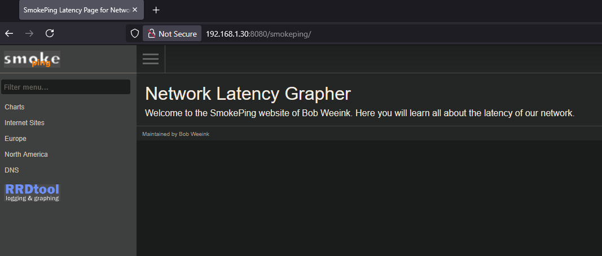
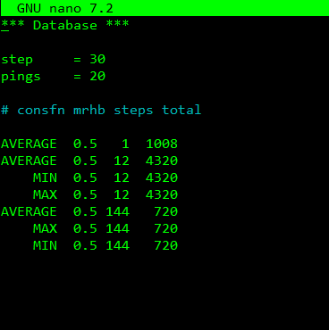

# Install smokeping using docker

## About smokeping

[smokeping](https://oss.oetiker.ch/smokeping/) is an awesome tool to measure latency and packet loss.

## Installation steps

SSH to your Linux docker host.

I use [KiTTY](https://www.9bis.net/kitty/index.html#!index.md) to ssh to my Linux docker host.

### Create a directory smokeping

```bash
mkdir smokeping
```

### Move to directory smokeping

```bash
cd smokeping
```

### Create docker compose file and open it with nano

```bash
sudo nano docker-compose.yaml
```

### Configure the docker compose file

Paste the following yaml code into nano:

```yaml
services:
  smokeping:
    image: lscr.io/linuxserver/smokeping:latest
    container_name: smokeping
#    hostname: smokeping #optional
    environment:
      - PUID=1000
      - PGID=1000
      - TZ=Etc/UTC
#      - MASTER_URL=http://<master-host-ip>:80/smokeping/ #optional
#      - SHARED_SECRET=password #optional
#      - CACHE_DIR=/tmp #optional
    volumes:
      - ./config:/config
      - ./data:/data
    ports:
      - 8080:80
    restart: unless-stopped
```

I want to access smokeping on port 8080, so I put in the following ports configuration:

```yaml  
    ports:
      - 8080:80
```

The port definition on the left side is your local host.  
The port definition on the right side is the port inside the docker container.

Save the file in nano with CTRL+O  
Hit Enter  
Exit nano with CTRL+X

### Build, create and start with docker compose

```bash
sudo docker compose up -d
```

The -d option makes the container run in the background.

## Smokeping homepage

Go to the IP address of the Linux docker host with port number 8080.  
>My host has IP 192.168.1.30 so that translates to <http://192.168.1.30:8080>

[](./screenshots/smokeping-homepage.png)

## Change ping interval

By default, smokeping sends 20 pings every 300 seconds.  
This interval can be changed in the database file.

From the smokeping directory let's do a dir to see the files and directories:

```bash
dir
```

The following directories and files appears:

```bash
config  data  docker-compose.yaml
```

Move to the config directory:

```bash
cd config
```

Let's do a dir to see the files and directories:

```bash
dir
```

The following directories and files appears:

```bash
Alerts  Database  General  httpd.conf  pathnames  Presentation  Probes  site-confs  Slaves  smokeping_secrets  ssmtp.conf  Targets
```

Open the database file with nano:

```bash
sudo nano Database
```

[](./screenshots/smokeping-database.png)

Change the step = value to the value you like, I have mine set to 30.  
Change the pings = value to the value you like, I have mine set to 20.  
These values tell smokeping to send 20 pings every 30 seconds.

Save the file in nano with CTRL+O  
Hit Enter  
Exit nano with CTRL+X

smokeping database [documentation](https://oss.oetiker.ch/smokeping/doc/smokeping_config.en.html) specifies the following regarding changing these values:

>Note that the step in the RRD files is fixed when they are originally generated, and if you change the step parameter afterwards, you'll have to delete the old RRD files or somehow convert them.
>Note that the number of pings in the RRD files is fixed when they are originally generated, and if you change this parameter afterwards, you'll have to delete the old RRD files or somehow convert them.

I choose the option to delete all data, since this is a brand-new installation of smokeping.

Change from current directory smokeping/config to the smokeping directory:

```bash
cd ..
```

From the smokeping directory, shutdown the smokeping docker container with docker compose:

```bash
sudo docker compose down
```

Let's check all files and directories:

```bash
dir
```

The following directories and files appears:

```bash
config  data  docker-compose.yaml
```

Delete the data directory with everything in it:

```bash
rm -r data
```

Let's check all files and directories:

```bash
dir
```

The data directory is gone:

```bash
config  docker-compose.yaml
```

Start the smokeping docker container with docker compose:

```bash
sudo docker compose up -d
```

When the smokeping docker starts it automatically creates the data directory.

Let's check all files and directories:

```bash
dir
```

The data directory is back:

```bash
config  data  docker-compose.yaml
```

Go to the smokeping website of your Linux docker host and after a minute there should be data displayed in the graphs.
