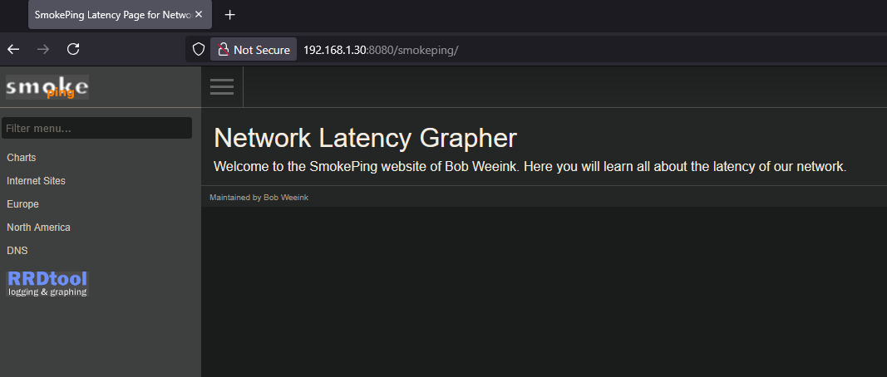

# Install smokeping using docker

## SSH to your docker host

>I use [KiTTY](https://www.9bis.net/kitty/index.html#!index.md) to ssh to my Linux host

### Create directory in Linux

```bash
mkdir smokeping
```

### Move to directory smokeping

```bash
cd smokeping
```

### Create docker compose file and open it with nano

```bash
sudo nano docker-compose.yaml
```

### Configure the docker compose file

Paste the following yaml code into nano

```yaml
services:
  smokeping:
    image: lscr.io/linuxserver/smokeping:latest
    container_name: smokeping
#    hostname: smokeping #optional
    environment:
      - PUID=1000
      - PGID=1000
      - TZ=Etc/UTC
#      - MASTER_URL=http://<master-host-ip>:80/smokeping/ #optional
#      - SHARED_SECRET=password #optional
#      - CACHE_DIR=/tmp #optional
    volumes:
      - ./config:/config
      - ./data:/data
    ports:
      - 8080:80
    restart: unless-stopped
```

I want to access smokeping on port 8080, so I put in the following ports configuration:

```yaml  
    ports:
      - 8080:80
```

The port definition on the left side is your local host  
The port definition on the right side is the port inside the docker container

Save the file in nano with CTRL+O  
Hit Enter  
Exite nano with CTRL+X

### Build, create and start with docker compose

```bash
sudo docker compose up -d
```

The -d option makes the container run in the background

### Open the smokeping website

Go to the IP address of the host with port number 8080  
My host has IP 192.168.1.30

> http://192.168.1.30:8080

### Smokeping homepage

[](./smokeping-homepage.png)
