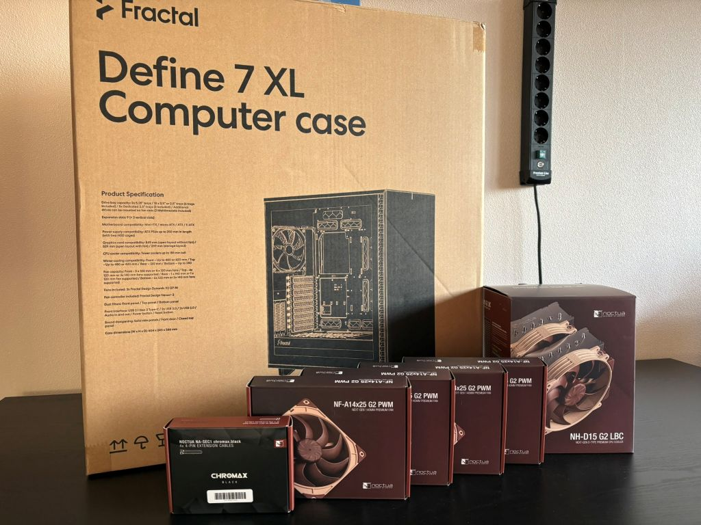
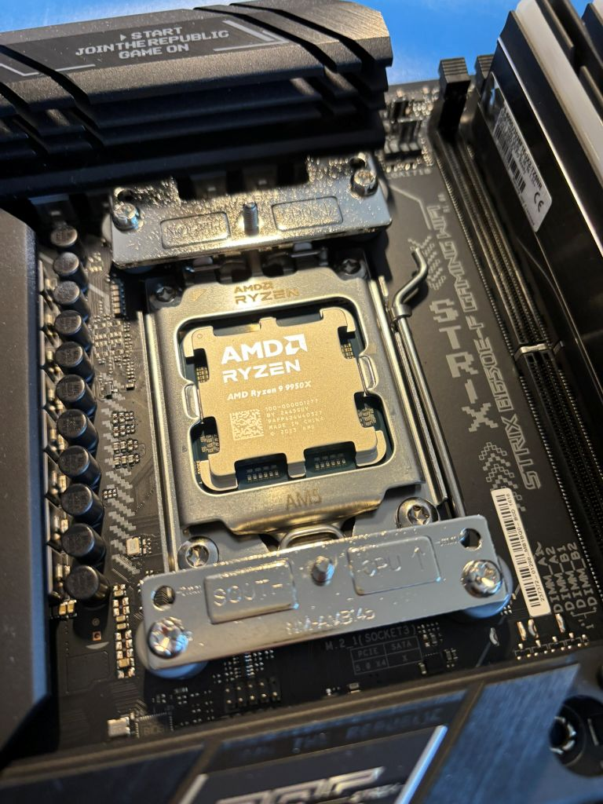
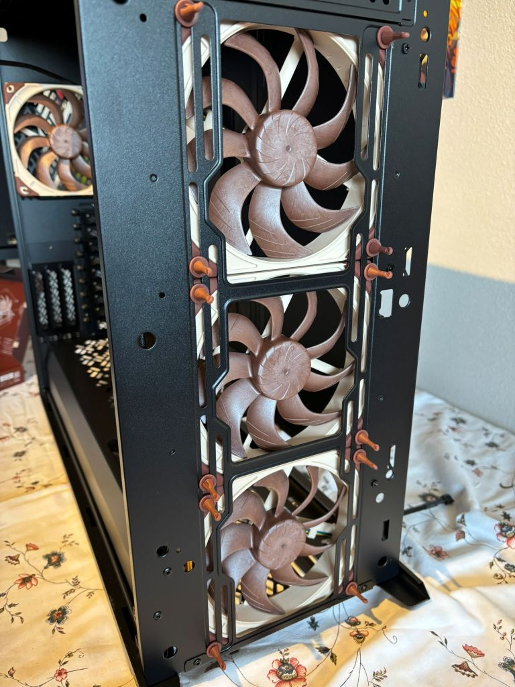
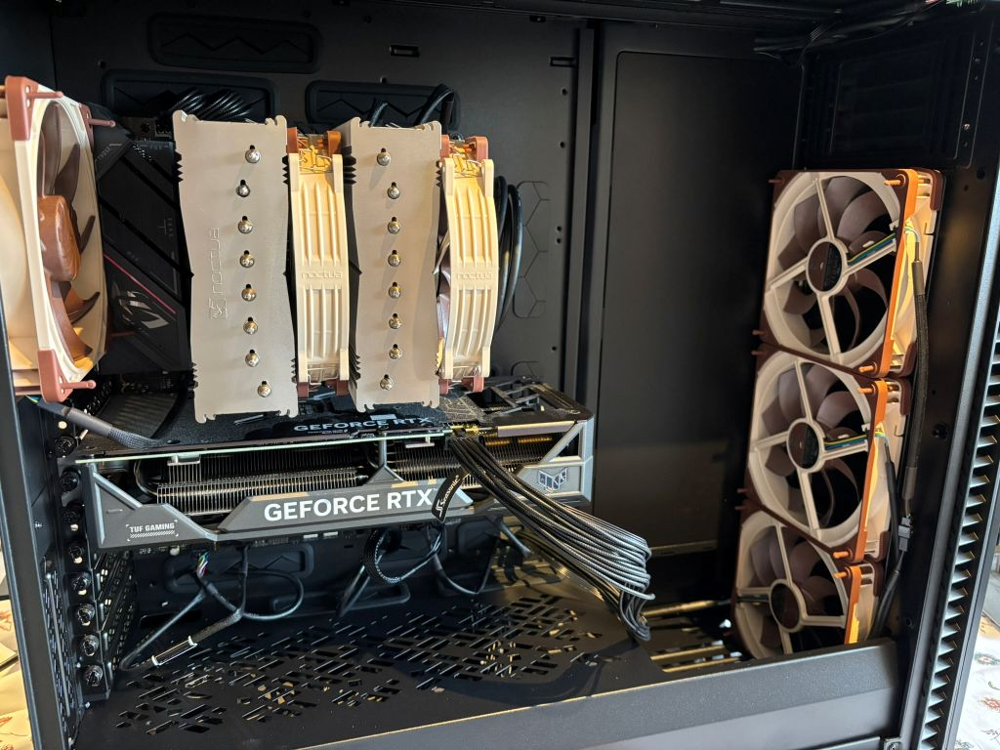
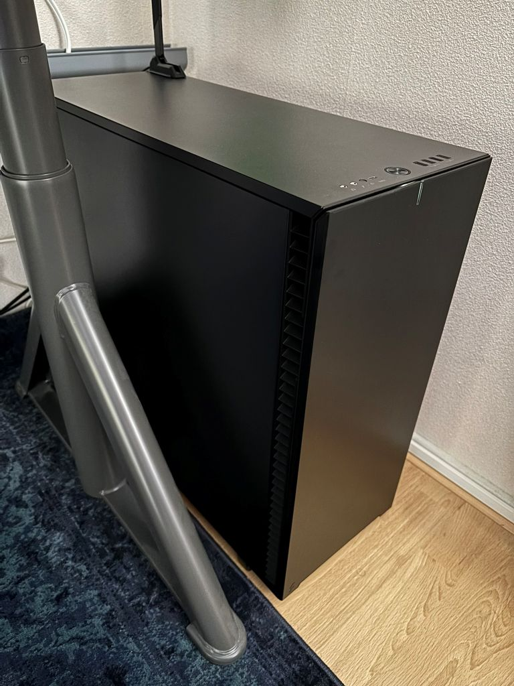

# Silent PC Workstation - 2025

## List of hardware

- CPU: [AMD Ryzen 9 9950X](https://www.amd.com/en/products/processors/desktops/ryzen/9000-series/amd-ryzen-9-9950x.html)  
- CPU Air Cooler: [Noctua NH-D15 G2](https://noctua.at/en/nh-d15-g2-lbc)  
- Memory: [G.Skill Trident Z5 Neo RGB F5-6000J3038F16GX2-TZ5NR](https://www.gskill.com/product/165/390/1661410135/F5-6000J3038F16GX2-TZ5NR)
- Motherboard: [ASUS ROG STRIX B650E-F GAMING WIFI](https://rog.asus.com/motherboards/rog-strix/rog-strix-b650e-f-gaming-wifi-model/)  
- Storage: 2x [WD Black SN770 NVMe SSD 1TB](https://shop.sandisk.com/products/ssd/internal-ssd/wd-black-sn770-nvme-ssd?sku=WDS100T3X0E-00B3N0)  
- Graphics card: [ASUS TUF Gaming GeForce RTX 4070 Ti SUPER 16GB GDDR6X OC Edition](https://www.asus.com/motherboards-components/graphics-cards/tuf-gaming/tuf-rtx4070tis-o16g-gaming/)  
- Power supply: [Seasonic Focus GX-1000](https://seasonic.com/focus-gx/)  
- Case: [Fractal Define 7 XL](https://www.fractal-design.com/products/cases/define/define-7-xl/black-tg-dark-tint/)  
- Case Fans: 4x [Noctua NF-A14x25 G2](https://noctua.at/en/nf-a14x25-g2-pwm)  
- Case Fans extension cables: [Noctua NA-SEC1 chromax.black](https://noctua.at/en/na-sec1-chromax-black)  

## Fan speed setttings

4x Case Fans: 30% always  
CPU Air Cooler: I would recommend 40% base and increase when the CPU gets to warm, when that is depends on your own use case.  
The following software is ideal to manage your computer fans: [Fan Control](https://getfancontrol.com/)  

## Images

  

  

  

  

  
