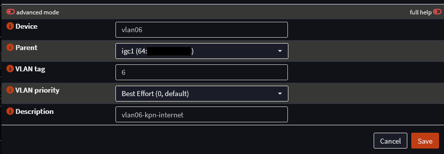
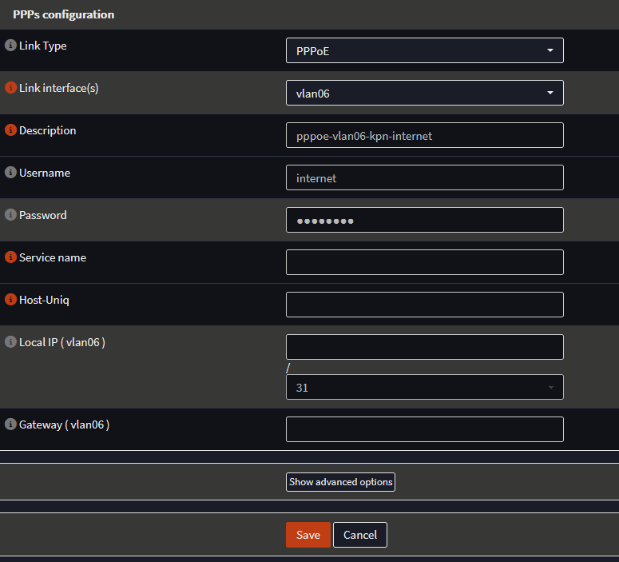
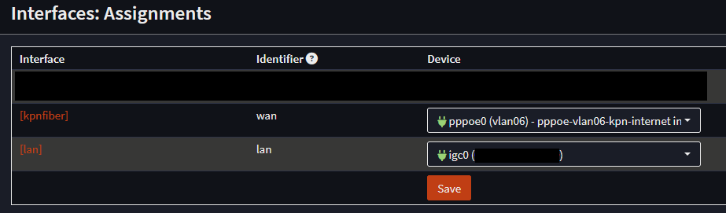
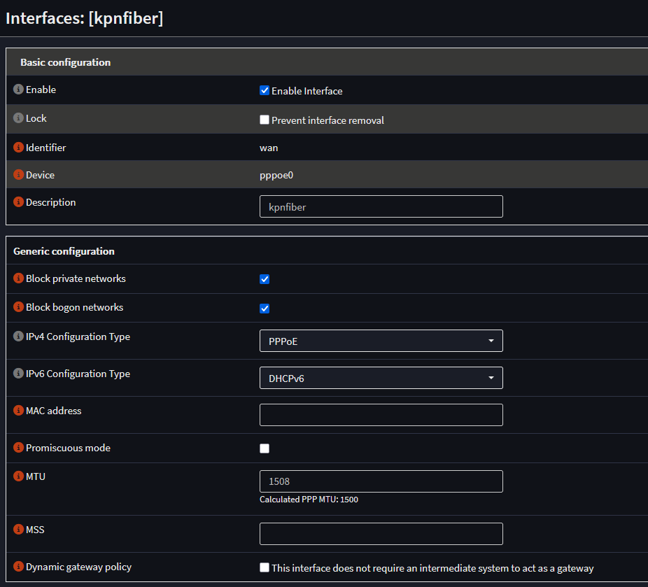
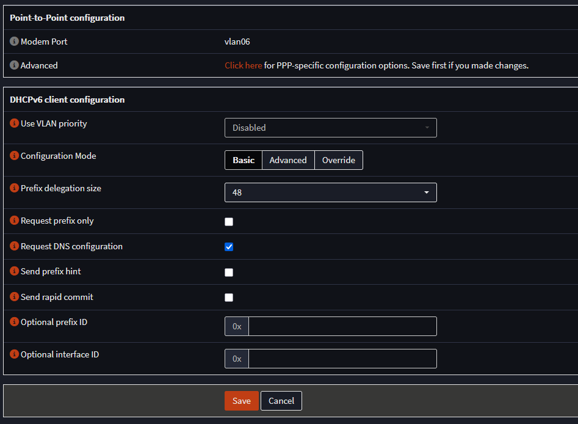
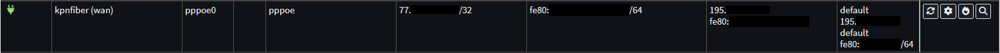

# KPN-fiber internet and OPNsense firewall  

I want to use my KPN-fiber internet with my own OPNsense firewall, I want OPNsense to have the public IPv4 and IPv6 address of my KPN-fiber internet.  

I am using KPN consumer based internet fiber, also known as FTTH (FiberToTheHome)  

The following is based on OPNsense version: 26.1.7_1-amd64  

## OPNsense

### WAN interface configuration

KPN-fiber uses PPPoE for IPv4 and DHCPv6 for IPv6 to deliver internet on your WAN port.  
KPN-fiber send the traffic tagged on VLAN ID 6 on your wan port.  

[KPN-fiber own equipment information page](https://www.kpn.com/service/eigen-apparatuur)  

#### Create the VLAN  

Interfaces > Devices > VLAN > Add

  

Parent interface = WAN interface  

#### Create the PPPoE interface  

Interfaces > Devices > Point-to-Point > Add  

  

The PPPoE interface is linked to the vlan interface of vlan6.

Username and password can be set to anything, I use internet/internet.  

#### Assign the PPPoE interface to the WAN interface

Interfaces > Assignments

  

I already gave my WAN port the description of kpnfiber, so that's why the name kpnfiber is in the above screenshot for the WAN port.  

#### Configure the WAN (kpnfiber) interface  

IPv4 address is delivered through PPPoE, IPv6 address is delivered through DHCPv6.  

To make use of [baby jumbo frames](https://www.rfc-editor.org/rfc/rfc4638.html) we set the MTU of our WAN interface to 1508.  

The IPv6 prefix that KPN delivers is a /48.  

Go to Interfaces > Overview and you should see that the KPN-fiber (wan) interface has a green status icon.  

Here you will also see the IPv4 and IPv6 address the OPNsense KPN-fiber (wan) interface has received.  
Important note here: The WAN interface will not receive a IPv6 address because KPN only sends a IPv6 prefix.  

For IPv4 connectivity you are now good to go.  
OPNsense will generate the outbound NAT rule for LAN to WAN [automatically](https://docs.opnsense.org/manual/nat.html)  

### IPv6 prefix

For IPv6 we have received a /48 prefix from KPN-fiber, an /48 prefix gives us 65536x an /64 IPv6 subnet to give out to our home networks/vlans.  

1x /64 IPv6 subnet gives us 18,446,744,073,709,551,616 (over 18 quintillion) addresses, so there is plenty to go around for all our devices on a single subnet/vlan.  

To find our KPN-fiber /48 prefix we go to Interfaces > Overview and click on the looking glass icon all the way to the right of our KPN-fiber (wan) entry.  

A new window will pop up and here we can scroll down to "Dynamic IPv6 prefix received" or search in this popup for prefix.  
You could see something like this for example:  
2a02:xxxx:xxxx::/48

After the last :: we have 4 hexadecimal characters that you can use to generate the 65536x /64 IPv6 subnets.  
Hexadecimal characters go from 0-9 and from A-F.  

The range for these 4 hexadecimal characters is from 0000 to FFFFF  

2a02:xxxx:xxxx:0000::/64  
2a02:xxxx:xxxx:0001::/64  
2a02:xxxx:xxxx:0002::/64  
etc  
etc  
2a02:xxxx:xxxx:fffd::/64  
2a02:xxxx:xxxx:fffe::/64  
2a02:xxxx:xxxx:ffff::/64  

#### IPv6 LAN subnet/vlan

For instance I gave my LAN interface a static IPv6 configuration with IP: 2a02:xxxx:xxxx:1111::1/64  

After the LAN interface has a static IPv6 address you need to enable IPv6 Router Advertisement to make sure network devices get IPv6 address automatically.  

Go to Services > Router Advertisements > LAN

You are free to use any IPv6 DNS server address in the DNS servers option fields.  
In my case I use a Raspberry Pi with Pi-hole as my DNS server for IPv6, so I added the IPv6 address of it as the IPv6 DNS server.  

### IPv6 DUID

It is a good idea to set a static IPv6 DUID (DHCP Unique Identifier)  
This makes sure that after a connection loss with KPN-fiber you will not receive a new IPv6 /48 prefix.  

To set a static IPv6 DUID go to Interfaces > Settings > IPv6 DHCP  
Select "Insert the existing DUID"  
Save
