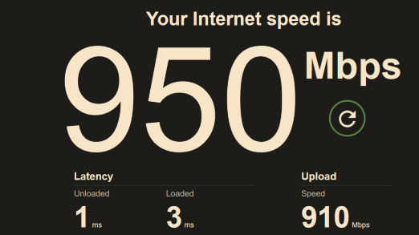
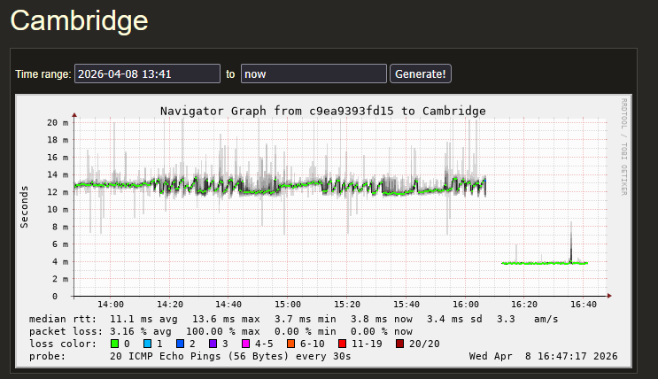
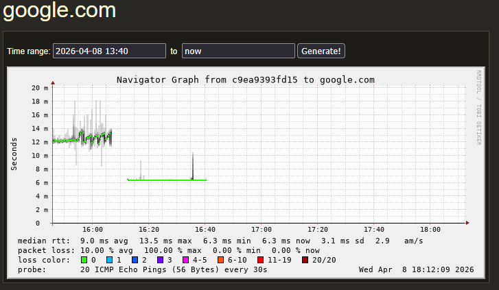

# Ziggo coax internet VS KPN fiber internet  

The elephant in the room is of course that KPN fiber has symmetrical up and download speeds and Ziggo coax does not, this in an age of more and more self-hosting and uploading it was time for me to change from Ziggo coax to KPN fiber.  

  

Before the switch I already had smokeping running on a docker container and was interested in the performance differences between Ziggo coax and KPN fiber internet.  

The results:  

  

  
