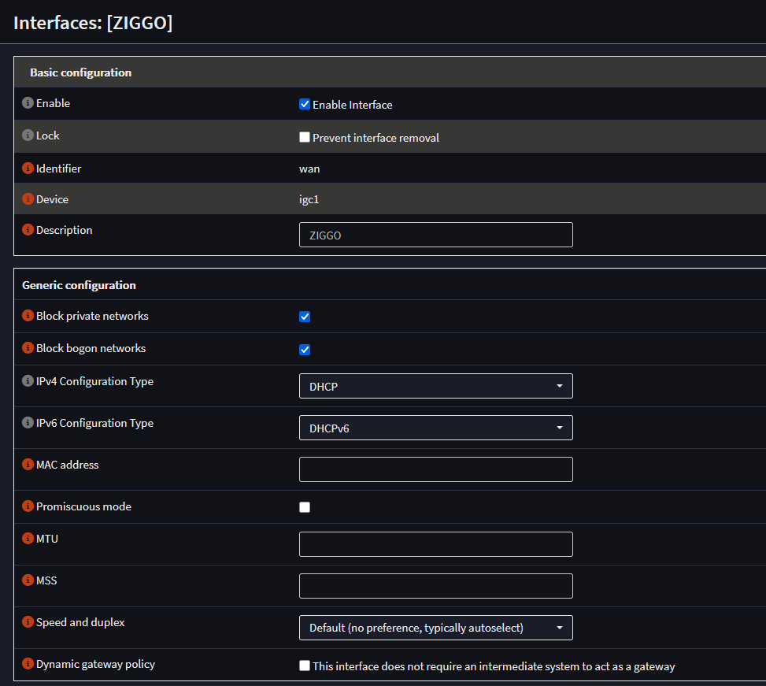
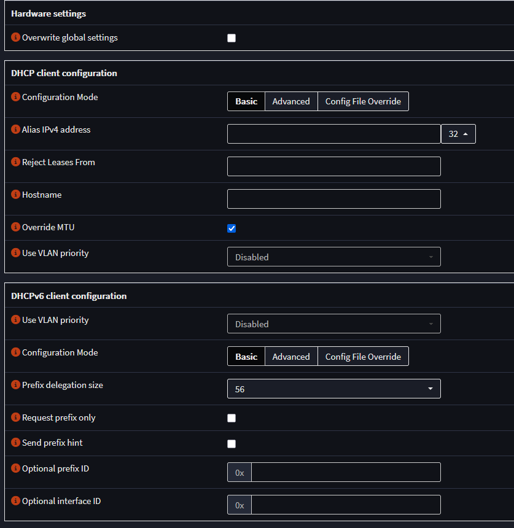
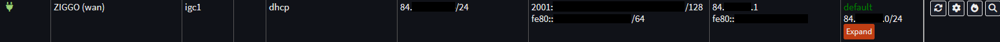
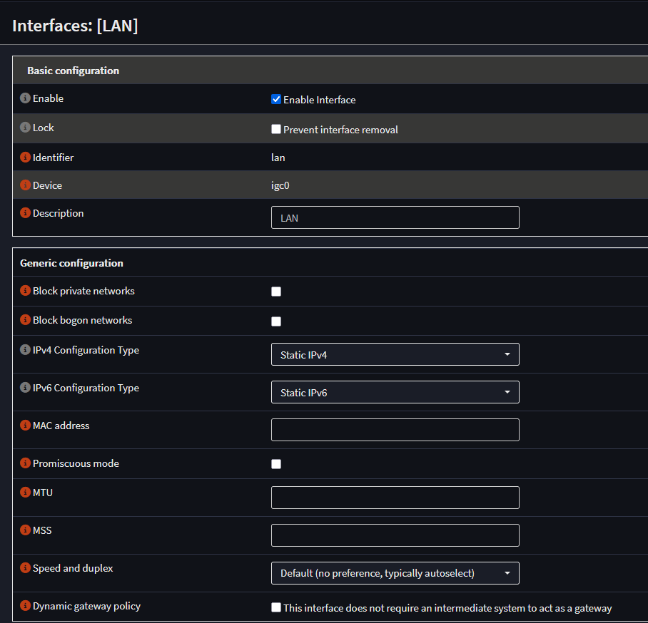
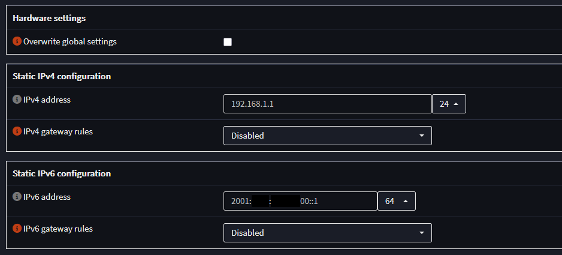
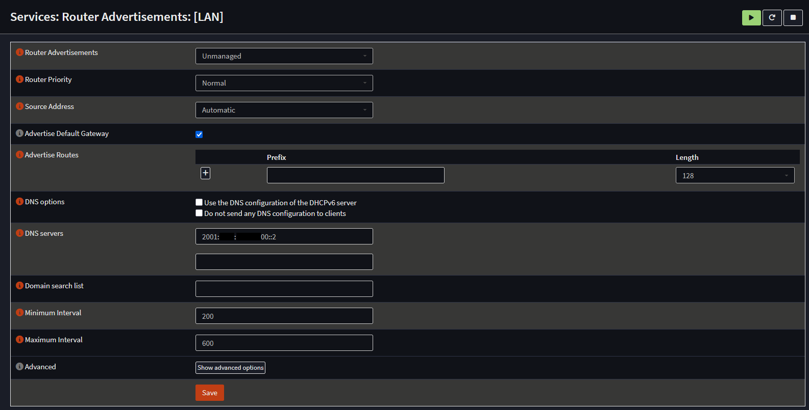

# Ziggo internet and OPNsense firewall  

I want to use my Ziggo internet with my own OPNsense firewall, I want OPNsense to have the public IPv4 and IPv6 address of my Ziggo internet.  

The following is based on OPNsense version: 25.7.11_9-amd64  

## Modem bridge mode

Before we can get a public IPv4 and IPv6 address on our OPNsense firewall we need to set our Ziggo modem in bridge mode.  
You can call Ziggo support to help you with this or through their app.  
[Ziggo bridge mode](https://www.ziggo.nl/klantenservice/internet-wifi/bridge-modus)  

## OPNsense

### WAN interface configuration

Go to the WAN interface and use the following configuration:  

  

  

Connect the Ziggo modem in bridge mode with a UTP cable to your WAN interface of OPNsense.  
Go to Interfaces > Overview and you should see that the ZIGGO (wan) interface has a green status icon.  

Here you will also see the IPv4 and IPv6 address the OPNsense ZIGGO (wan) interface has received through DHCP.  

For IPv4 connectivity you are now good to go, OPNsense will generate the outbound NAT rule for LAN to WAN [automatically](https://docs.opnsense.org/manual/nat.html)  

### IPv6 prefix

For IPv6 we have received a /56 prefix from ZIGGO, an /56 prefix gives us 256x an /64 IPv6 subnet to give out to our home networks/vlans.  

1x /64 IPv6 subnet gives us 18,446,744,073,709,551,616 (over 18 quintillion) addresses, so there is plenty to go around for all our devices on a single subnet/vlan.  

To find our Ziggo /56 prefix we go to Interfaces > Overview and click on the looking glass icon all the way to the right of our ZIGGO (wan) entry.  

A new window will pop up and here we can scroll down to "Dynamic IPv6 prefix received" or search in this popup for prefix.  
You could see something like this for example:  
2001:xxxx:xxxx:xxxx::/56

The last 2 xx before :: are the hexadecimal characters that you can use to generate the 256x /64 IPv6 subnets.  
Hexadecimal characters go from 0-9 and from A-F.  

The range for these two last xx before the :: is from 00 to FF  

2001:xxxx:xxxx:xx00::/64  
2001:xxxx:xxxx:xx01::/64  
2001:xxxx:xxxx:xx02::/64  
etc  
etc  
2001:xxxx:xxxx:xxfd::/64  
2001:xxxx:xxxx:xxfe::/64  
2001:xxxx:xxxx:xxff::/64  

#### IPv6 LAN subnet/vlan

For instance I gave my LAN interface a static IPv6 configuration with IP: 2001:xxxx:xxxx:xx00::1/64  

  

  

After the LAN interface has a static IPv6 address you need to enable IPv6 Router Advertisement to make sure network devices get IPv6 address automatically.  

Go to Services > Router Advertisements > LAN

  

You are free to use any IPv6 DNS server address in the DNS servers option fields.  
In my case I use a Raspberry Pi with Pi-hole as my DNS server for IPv6, so I added the IPv6 address of it as the IPv6 DNS server.  

### IPv6 DUID

It is a good idea to set a static IPv6 DUID (DHCP Unique Identifier)  
This makes sure that after a connection loss with Ziggo you will not receive a new IPv6 /56 prefix.  

To set a static IPv6 DUID go to Interfaces > Settings > IPv6 DHCP  
Select "Insert the existing DUID"  
Save
